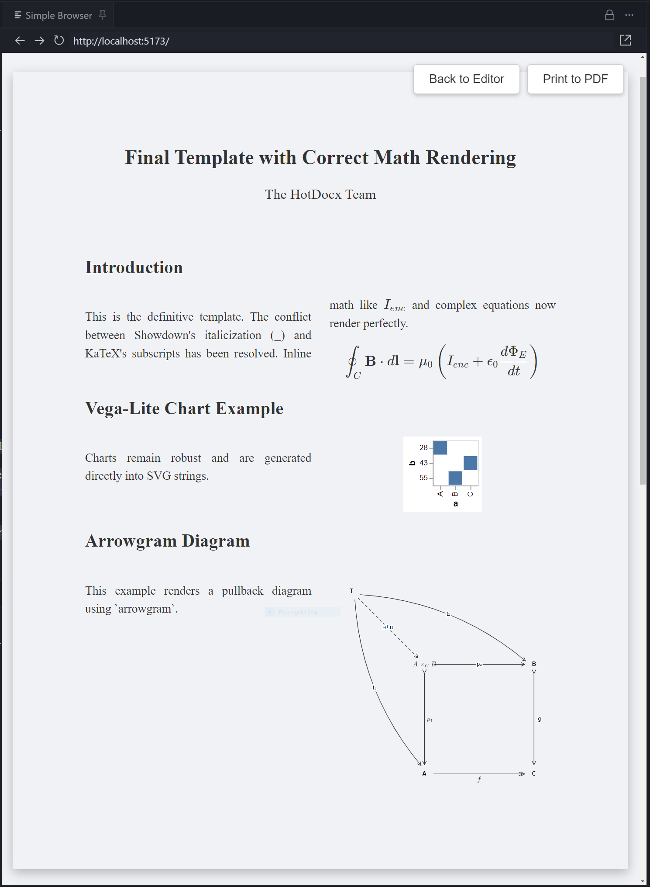

# Arrowgram

**Arrowgram** is a production-grade toolkit for creating commutative diagrams for the web and research papers. It is designed to be easily used by humans (via a sleek web editor) and AI coding agents (via a strictly typed JSON API).



## Key Features

-   **Declarative Syntax:** JSON-based specification (`DiagramSpec`) that is human-readable and AI-friendly.
    -   *Note: In JSON strings, LaTeX backslashes must be escaped (e.g. `$\\to$`).*
-   **Modern Web Editor:**
    -   **Project Management:** Create, save, and manage multiple diagrams locally (IndexedDB).
    -   **Keyboard First:** Vim-like speed for power users (`Shift+Drag` to connect, `Ctrl+Z` to undo).
    -   **Manipulation:** Flip, Reverse, Rotate, and Fit-to-screen tools.
    -   **AI Co-Pilot:** Native integration with Google Gemini 2.0 to generate and modify diagrams via natural language.
    -   **High-Quality Rendering:** KaTeX integration for beautiful mathematical typography.
    -   **Advanced Styles:** Support for adjunctions, pullbacks, squiggly arrows, proarrows, bullets, and more.
-   **Production Ready:**
    -   **Export:** SVG, PNG, and TikZ-CD (for LaTeX papers).
    -   **Standalone Library:** Use `@arrowgram/core` in your own React apps or server-side pipelines.

## Repository Structure

This is a monorepo managed by NPM Workspaces.

-   **`packages/arrowgram`**: The core library. Contains the geometry engine, Zod schemas, and React renderer. Tested with **Vitest**.
-   **`packages/web`**: The official web-based editor. Built with React, Vite, and Paged.js. Tested with **Jest**.
-   **`tmp-quiver-codebase`**, **`tmp-arrowgram-original`**: Reference implementations and inspiration sources.

## Getting Started

### Prerequisites
-   Node.js (v20+)
-   NPM (v10+)
-   (Optional) Google Gemini API Key for AI features.

### Installation

```bash
git clone https://github.com/hotdocx/arrowgram.git
cd arrowgram
npm install
```

### Development

**Start the Web Editor:**

```bash
npm run dev
# Starts Vite dev server at http://localhost:5173 (usually)
```

**Run Tests:**

```bash
# Core Library Tests (Geometry, Schema)
npm test --workspace=packages/arrowgram

# Web App Tests (Components, Logic)
npm test --workspace=packages/web
```

**Build All Packages:**

```bash
npm run build
```

## For AI Agents

Are you an LLM trying to generate a diagram? Read [AGENTS.md](./packages/paged/AGENTS.md) for the complete API specification and examples.

## Documentation

-   [Product Requirements (PRD)](./PRD.md)
-   [Functional Specification](./docs/FUNCTIONAL_SPEC.md)
-   [JSON API Specification](./docs/ARROWGRAM_SPEC.md)
-   **Standard Operating Procedures (SOPs):**
    -   [Development Flow](./docs/sop/DEVELOPMENT_FLOW.md)
    -   [Architecture & Design](./docs/sop/ARCHITECTURE.md)
    -   [Testing Strategy](./docs/sop/TESTING.md)
-   [Contributing SOP](./docs/SOP_CONTRIBUTING.md)

## License

MIT