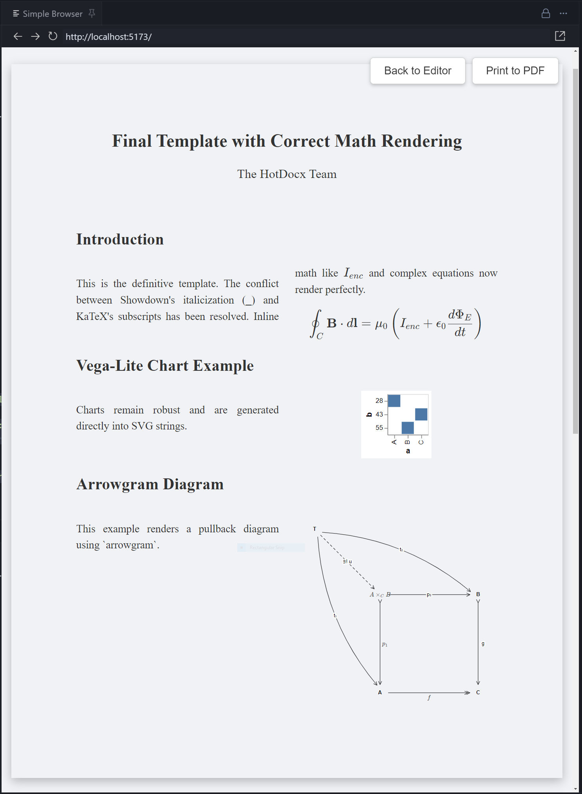

## `arrowgram`

`arrowgram` is a React component that renders SVG diagrams of arrows, nodes, and labels from a declarative JSON specification. It is designed for creating mathematical diagrams, such as commutative diagrams used in category theory, directly within a web application.

The component is self-contained, performing all necessary geometric calculations to translate the abstract specification into a visually clear SVG representation. It is intended for use in markdown rendering pipelines or interactive development environments like Sandpack.

### Quick links

[1] *arrowgram AI Template in hotdocx Publisher Web App*. [https://hotdocx.github.io/#/hdx/25188CHRI26000](https://hotdocx.github.io/#/hdx/25188CHRI26000) 

[2] *emdash functorial programming language for ω-categories and schemes*. [https://github.com/hotdocx/emdash](https://github.com/hotdocx/emdash) 

### Other links

[3] *emdash Experiment-able Testing Playground in hotdocx Publishers*. [https://hotdocx.github.io/#/hdx/25188CHRI27000](https://hotdocx.github.io/#/hdx/25188CHRI27000) 

[4] *emdash Re-formattable Technical Report in hotdocx Publisher*. [https://hotdocx.github.io/#/hdx/25188CHRI25004](https://hotdocx.github.io/#/hdx/25188CHRI25004) 

[5] *jsCoq AI Template for Coq in hotdocx Publisher*. [https://hotdocx.github.io/#/hdx/25191CHRI43000](https://hotdocx.github.io/#/hdx/25191CHRI43000)

[6] *hotdocX GitHub Sponsored Profile*. [https://github.com/sponsors/hotdocx](https://github.com/sponsors/hotdocx)

## Key Features

-   **Declarative JSON:** Define complex diagrams with a simple and intuitive JSON structure.
-   **SVG Rendering:** Automatically renders clean, auto-sizing SVG diagrams that fit any layout.
-   **KaTeX Math Support:** Render complex mathematical formulas in labels using familiar LaTeX syntax.
-   **Higher-Order Arrows:** Create arrows between other arrows, essential for 2-category diagrams and natural transformations.
-   **`q.uiver.app` Interoperability:** Seamlessly import diagrams from and export them to `q.uiver.app` share URLs.
-   **Customizable Styling:** A range of styling options for arrows (solid, dashed, dotted), heads (normal, epi), and tails (mono).



## Integration in a Rendering Pipeline

`arrowgram` is designed to be easily integrated into document-rendering pipelines that process extended markdown. By wrapping a valid `arrowgram` JSON specification in a `<div>`, you can process and embed diagrams alongside other content types like `vega-lite` charts or `mermaid` diagrams.

The processor should find blocks like the one below, parse the JSON content, render it to an SVG string using `arrowgram`, and replace the original `<div>` with the resulting SVG.

**Example Markdown:**
```markdown
<div class="arrowgram">
{
  "nodes": [
    { "name": "A", "left": 100, "top": 100, "label": "A" },
    { "name": "B", "left": 400, "top": 100, "label": "B" }
  ],
  "arrows": [
    { "name": "eta", "from": "A", "to": "B", "label": "$\\eta$" }
  ]
}
</div>
```
This enables `arrowgram` to work seamlessly with libraries like `showdown`, `pagedjs`, and `katex`.

## Architecture and Design

The architecture of `arrowgram` is centered around a single, robust React component, `<ArrowGram />`.

-   **Component-Based:** The entire diagram rendering logic is encapsulated within the `ArrowGram.jsx` component. This makes it easy to integrate into any React application.
-   **Declarative Specification:** The design separates the diagram's definition (the "what") from its rendering (the "how"). Users provide a simple JSON object describing the nodes and arrows, and the component handles the complex task of drawing it. This makes creating and modifying diagrams straightforward.
-   **Stateless Rendering:** The component is designed to be stateless. It receives a JSON specification as a prop and renders the corresponding SVG. All calculations are derived from these props, using `useMemo` for performance optimization.

## Implementation Details

### The `<ArrowGram />` Component

The core logic resides within the `<ArrowGram />` component.

1.  **Parsing:** It accepts a JSON string (`spec`) as a prop, which it parses into a JavaScript object.
2.  **Model Creation:** It processes the `nodes` and `arrows` from the spec to create an internal, render-ready data structure. This includes resolving dependencies for higher-order arrows.
3.  **ViewBox Calculation:** It dynamically calculates the SVG `viewBox` by determining the bounding box of all nodes and control points, ensuring the entire diagram is always visible.
4.  **SVG Rendering:** It maps over the internal models and renders them as a series of SVG `<g>`, `<path>`, and `<text>` elements.

### Higher-Order Arrows

A key feature of `arrowgram` is its ability to render "higher-order arrows"—arrows that have other arrows as their source or target.

This is achieved by treating every arrow as a potential "virtual node." When an arrow is defined, the component calculates its midpoint. If another arrow uses the first arrow's `name` as its `from` or `to` property, the component uses this calculated midpoint as the connection point.

To prevent visual overlap, the component also calculates a "radius" for these virtual nodes, ensuring that the connecting arrow starts and ends with a clean gap, just as it would with a regular node. This allows for creating complex, multi-level diagrams like 2-cells in category theory.

### The JSON Specification

A diagram is defined by a JSON object with two main keys: `nodes` and `arrows`.

#### Node Objects

-   `name` (string): A unique identifier for the node.
-   `label` (string): The text to display. Supports KaTeX math by wrapping formulas in `$`, e.g., `"$A \\times_C B$"`.
-   `left`, `top` (number): The x and y coordinates.

#### Arrow Objects

-   `name` (string, optional): A unique identifier, required if the arrow is a source/target for another arrow.
-   `from`, `to` (string): The `name` of the starting and ending node *or arrow*.
-   `label` (string, optional): Text displayed alongside the arrow. Supports KaTeX math by wrapping formulas in `$`, e.g., `"$F(f)$"`.
-   `curve` (number, optional): Controls curvature.
-   `shift` (number, optional): Shifts the arrow perpendicular to its direction.
-   `label_alignment` (string, optional): `"over"` (default), `"left"`, or `"right"`.
-   `style` (object, optional): Controls visual style.
    -   `body`: `{ "name": "solid" | "dashed" | "dotted" }`
    -   `head`: `{ "name": "normal" | "epi" | "none" }`
    -   `tail`: `{ "name": "mono" | "none" }`
-   `level` (number, optional): Draws multiple parallel lines for the arrow body (e.g., for equality).

### `q.uiver.app` Interoperability

The utilities in `src/utils/quiver.js` provide two-way compatibility with `q.uiver.app`. Because `q.uiver.app` renders all labels as math by default, the utilities perform automatic conversion.

-   `decodeQuiverUrl(url)`: Parses a `q.uiver.app` share URL. During import, it automatically wraps all diagram labels with `$` delimiters to ensure they are rendered correctly by `arrowgram`'s internal KaTeX processor.
-   `encodeArrowgram(spec)`: Takes an `arrowgram` JSON spec and generates a `q.uiver.app` share URL. During export, it automatically removes the `$` delimiters from labels, as `q.uiver.app` will render them as math by default.

## Example Gallery

The `App.jsx` component includes several examples that demonstrate the capabilities of `arrowgram`.

### Pullback Diagram

A standard diagram in category theory, showcasing basic nodes, arrows, and styling (mono, epi, dashed).

```json
{
  "nodes": [
    { "name": "T", "left": 100, "top": 100, "label": "T" },
    { "name": "P", "left": 300, "top": 300, "label": "$A \\times_C B$" },
    { "name": "A", "left": 300, "top": 600, "label": "A" },
    { "name": "B", "left": 600, "top": 300, "label": "B" },
    { "name": "C", "left": 600, "top": 600, "label": "C" }
  ],
  "arrows": [
    { "from": "P", "to": "A", "label": "$p_1$", "style": { "tail": { "name": "mono" } } },
    { "from": "P", "to": "B", "label": "$p_2$" },
    { "from": "A", "to": "C", "label": "f", "label_alignment": "left", "style": { "head": { "name": "epi" } } },
    { "from": "B", "to": "C", "label": "g", "label_alignment": "right", "style": { "tail": { "name": "mono" } } },
    { "from": "T", "to": "A", "label": "$t_1$", "curve": -80 },
    { "from": "T", "to": "B", "label": "$t_2$", "curve": 80 },
    { "from": "T", "to": "P", "label": "$\\exists! u$", "style": { "body": { "name": "dashed" } } }
  ]
}
```

### Natural Transformation

This example demonstrates a higher-order arrow (`eta`) connecting two parallel arrows (`f` and `g`), representing a natural transformation.

```json
{
  "nodes": [
    { "name": "A", "left": 100, "top": 100, "label": "A" },
    { "name": "B", "left": 400, "top": 100, "label": "B" }
  ],
  "arrows": [
    { "name": "f", "from": "A", "to": "B", "label": "$F(f)$", "curve": -90 },
    { "name": "g", "from": "A", "to": "B", "label": "$G(f)$", "curve": 90 },
    { "name": "eta", "from": "f", "to": "g", "label": "$\\eta$", "style": { "head": { "name": "epi" } } }
  ]
}
```

### Higher-Order Square

A more complex diagram showing a commutative square where the commutation is expressed by higher-order arrows. It also showcases multi-line arrows (`level: 2`).

```json
{
  "nodes": [
    { "name": "A", "left": 100, "top": 100, "label": "A" },
    { "name": "B", "left": 500, "top": 100, "label": "B" },
    { "name": "C", "left": 100, "top": 400, "label": "C" },
    { "name": "D", "left": 500, "top": 400, "label": "D" }
  ],
  "arrows": [
    { "name": "top_arrow", "from": "A", "to": "B", "label": "f", "curve": 90 },
    { "name": "bottom_arrow", "from": "C", "to": "D", "label": "g" },
    { "name": "left_arrow", "from": "A", "to": "C", "label": "$\\alpha$" },
    { "name": "right_arrow", "from": "B", "to": "D", "label": "$\\beta$" },
    { "name": "diag1", "from": "top_arrow", "to": "right_arrow", "label": "$\\eta$", "curve": 40, "label_alignment": "left",
      "style": { "level": 2,  "head": { "name": "epi" },  "tail": { "name": "mono" }  } },
    { "name": "diag2", "from": "left_arrow", "to": "bottom_arrow", "label": "$\\epsilon$", "curve": -40, "label_alignment": "right" }
  ]
}
```

### Arrows Between Higher-Order Arrows ("Higher-Order-ception")

This example pushes the concept further, drawing an arrow (`h3`) between two other higher-order arrows (`h1` and `h2`). This demonstrates the recursive capability of the rendering engine.

```json
{
  "nodes": [
    { "name": "A", "left": 100, "top": 100, "label": "A" },
    { "name": "B", "left": 600, "top": 100, "label": "B" },
    { "name": "C", "left": 100, "top": 400, "label": "C" },
    { "name": "D", "left": 600, "top": 400, "label": "D" }
  ],
  "arrows": [
    { "name": "f1", "from": "A", "to": "B", "label": "$f_1$", "curve": -90 },
    { "name": "f2", "from": "A", "to": "B", "label": "$f_2$", "curve": 90 },
    { "name": "g1", "from": "C", "to": "D", "label": "$g_1$", "curve": -60 },
    { "name": "g2", "from": "C", "to": "D", "label": "$g_2$", "curve": 60 },
    { "name": "h1", "from": "f1", "to": "f2", "label": "$h_1$", "curve": -90,
      "style": { "level": 2 }  },
    { "name": "h2", "from": "g1", "to": "g2", "label": "$h_2$", "curve": 90  },
    { "name": "h3", "from": "h1", "to": "h2", "label": "$h_3$", "curve": -50,
      "style": { "level": 3 } }
  ]
}
```

## Future Work

-   [ ] Expand the range of available arrow and node styles to match `q.uiver.app` more closely (e.g., different arrow bodies, node shapes).
-   [ ] Support additional `q.uiver.app` features like cell coloring and grid snapping in the conversion utilities.
-   [ ] Improve performance for extremely large and complex diagrams.
-   [ ] Add interactive features, such as dragging nodes or editing labels directly on the SVG canvas.
